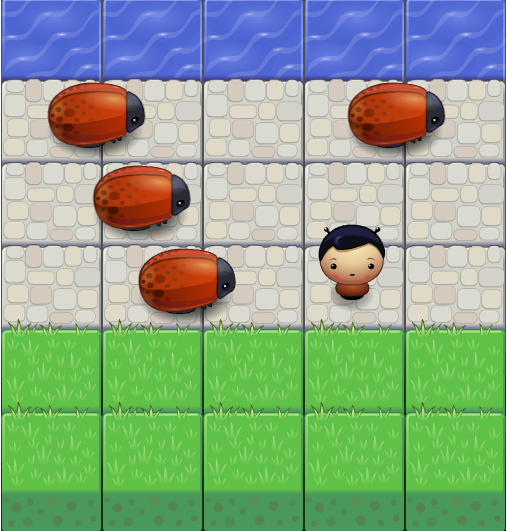

# frontend-nanodegree-arcade-game project

### How to run the game ?
To run the game click on index.html page and it will run auto. have fun :)

### How to win ?
you have to arrive to the water pool without collisions'touch' the any bugs to win.

### What will happen when the character collisions the bugs?
The character will start over .

### How to play the game ?
you have to move the character to water pool by :
- To go up use key 'up'.
- To go down use key 'down'.
- To go left use key 'left'.
- To go right use key 'right'.

### The game image:
https://alfehaid.github.io/game/images/.png

### The game link is:
https://alfehaid.github.io/game/

